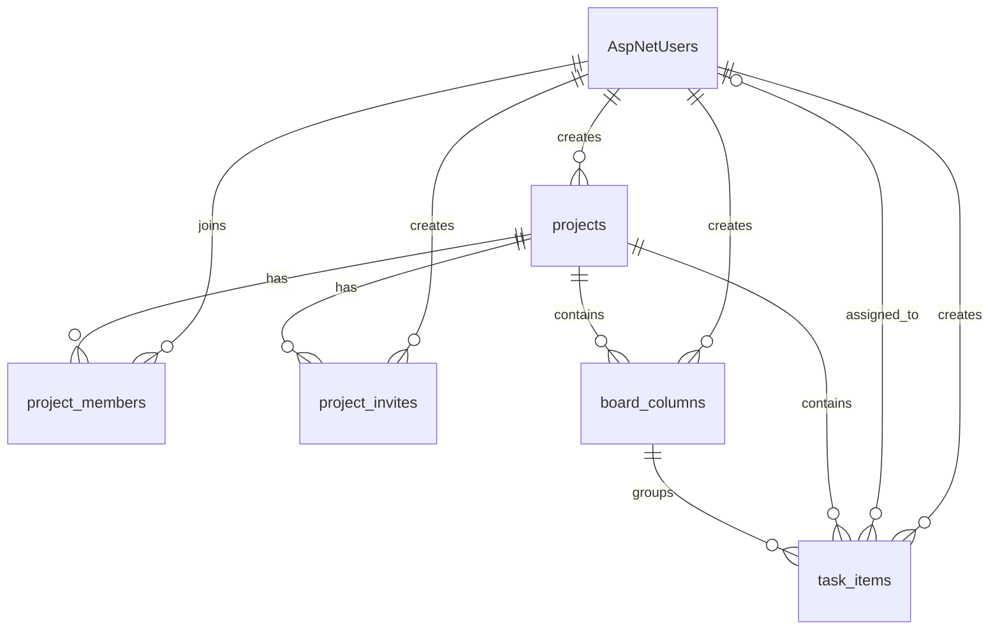

# Real-time Task Management ER Diagram

> Status: Target schema for the MVP. The current EF Core models and migrations must be updated to match this document before the schema is considered implemented.
>
> Database: SQL Server / Azure SQL. All application timestamps use UTC and `datetimeoffset(7)`. ASP.NET Core Identity owns authentication tables; project roles are stored in `project_members`, not `AspNetRoles`.

## Diagram

---

## Table definitions

### `AspNetUsers`

Managed by ASP.NET Core Identity. Only fields relevant to this application are shown; Identity also creates its supporting claims, login, role, and token tables.

| Column | Type | Key | Nullable | Default | Description |
| --- | --- | --- | --- | --- | --- |
| `Id` | `nvarchar(450)` | PK | No | Identity generated | Unique identifier of the user |
| `UserName` | `nvarchar(256)` | — | Yes | `NULL` | Username used to sign in |
| `NormalizedUserName` | `nvarchar(256)` | UK | Yes | `NULL` | Normalized username used by Identity |
| `Email` | `nvarchar(256)` | — | Yes | `NULL` | User email address |
| `NormalizedEmail` | `nvarchar(256)` | UK | Yes | `NULL` | Normalized email used for unique-email validation |
| `EmailConfirmed` | `bit` | — | No | `0` | Indicates whether the email is confirmed |
| `PasswordHash` | `nvarchar(max)` | — | Yes | `NULL` | Password hash managed by Identity |
| `DisplayName` | `nvarchar(100)` | — | No | `''` | Name displayed in the application |
| `LockoutEnd` | `datetimeoffset(7)` | — | Yes | `NULL` | Date and time when account lockout ends |
| `LockoutEnabled` | `bit` | — | No | `1` | Indicates whether lockout is enabled |
| `AccessFailedCount` | `int` | — | No | `0` | Failed sign-in count managed by Identity |
| `CreatedAtUtc` | `datetimeoffset(7)` | — | No | `SYSUTCDATETIME()` | Date and time when the account was created |
| `ConcurrencyStamp` | `nvarchar(max)` | — | Yes | `NULL` | Identity concurrency token |

---

### `projects`

Stores project information. Projects are private by default and can only be opened by active project members.

| Column | Type | Key | Nullable | Default | Description |
| --- | --- | --- | --- | --- | --- |
| `project_id` | `uniqueidentifier` | PK | No | Application generated | Unique identifier of the project |
| `project_name` | `nvarchar(120)` | — | No | — | Name of the project; duplicate names are allowed |
| `description` | `nvarchar(500)` | — | Yes | `NULL` | Short project description |
| `slug` | `nvarchar(140)` | UK | No | — | Unique slug used in the project URL |
| `created_by_user_id` | `nvarchar(450)` | FK → `AspNetUsers.Id` | No | — | User who originally created the project |
| `created_at_utc` | `datetimeoffset(7)` | — | No | `SYSUTCDATETIME()` | Date and time when the project was created |
| `updated_at_utc` | `datetimeoffset(7)` | — | Yes | `NULL` | Date and time when the project was last updated |
| `deleted_at_utc` | `datetimeoffset(7)` | — | Yes | `NULL` | Date and time when the project was soft deleted |
| `deleted_by_user_id` | `nvarchar(450)` | FK → `AspNetUsers.Id` | Yes | `NULL` | User who deleted the project |
| `row_version` | `rowversion` | — | No | Auto | Optimistic concurrency token |

---

### `project_members`

Stores project memberships and project-level roles. A removed member retains the same row so the membership can be restored later.

| Column | Type | Key | Nullable | Default | Description |
| --- | --- | --- | --- | --- | --- |
| `project_member_id` | `uniqueidentifier` | PK | No | Application generated | Unique identifier of the membership |
| `project_id` | `uniqueidentifier` | FK → `projects.project_id` | No | — | Project associated with the membership |
| `user_id` | `nvarchar(450)` | FK → `AspNetUsers.Id` | No | — | User associated with the membership |
| `role` | `varchar(20)` | — | No | `'Member'` | Project-level role: `Owner` or `Member` |
| `joined_at_utc` | `datetimeoffset(7)` | — | No | `SYSUTCDATETIME()` | Date and time when the user joined the project |
| `updated_at_utc` | `datetimeoffset(7)` | — | Yes | `NULL` | Date and time when the membership was last updated |
| `removed_at_utc` | `datetimeoffset(7)` | — | Yes | `NULL` | Date and time when the member was removed |
| `removed_by_user_id` | `nvarchar(450)` | FK → `AspNetUsers.Id` | Yes | `NULL` | User who removed the member |
| `row_version` | `rowversion` | — | No | Auto | Optimistic concurrency token |

---

### `project_invites`

Stores revocable and expiring project invite codes. Only the SHA-256 hash of the code is persisted.

| Column | Type | Key | Nullable | Default | Description |
| --- | --- | --- | --- | --- | --- |
| `project_invite_id` | `uniqueidentifier` | PK | No | Application generated | Unique identifier of the project invite |
| `project_id` | `uniqueidentifier` | FK → `projects.project_id` | No | — | Project associated with the invite |
| `role` | `varchar(20)` | — | No | `'Member'` | Role assigned after accepting the invite |
| `max_uses` | `int` | — | Yes | `NULL` | Maximum redemptions; `NULL` means unlimited |
| `used_count` | `int` | — | No | `0` | Number of successful redemptions |
| `code_hash` | `char(64)` | UK | No | — | Hex-encoded SHA-256 hash of the invite code |
| `created_by_user_id` | `nvarchar(450)` | FK → `AspNetUsers.Id` | No | — | User who created the invite |
| `expires_at_utc` | `datetimeoffset(7)` | — | No | — | Date and time when the invite expires |
| `created_at_utc` | `datetimeoffset(7)` | — | No | `SYSUTCDATETIME()` | Date and time when the invite was created |
| `revoked_at_utc` | `datetimeoffset(7)` | — | Yes | `NULL` | Date and time when the invite was revoked |
| `row_version` | `rowversion` | — | No | Auto | Concurrency token used when redeeming the invite |

---

### `board_columns`

Stores the ordered columns of a project's Kanban board. `column_key` is stable; `name` can be renamed or localized.

| Column | Type | Key | Nullable | Default | Description |
| --- | --- | --- | --- | --- | --- |
| `board_column_id` | `uniqueidentifier` | PK | No | Application generated | Unique identifier of the board column |
| `project_id` | `uniqueidentifier` | FK → `projects.project_id` | No | — | Project associated with the column |
| `name` | `nvarchar(80)` | — | No | — | Display name of the column |
| `column_key` | `varchar(40)` | — | No | — | Stable machine-readable column key |
| `sort_order` | `int` | — | No | `0` | Display order within the project board |
| `created_by_user_id` | `nvarchar(450)` | FK → `AspNetUsers.Id` | No | — | User who created the column |
| `created_at_utc` | `datetimeoffset(7)` | — | No | `SYSUTCDATETIME()` | Date and time when the column was created |
| `updated_at_utc` | `datetimeoffset(7)` | — | Yes | `NULL` | Date and time when the column was last updated |
| `row_version` | `rowversion` | — | No | Auto | Concurrency token for rename and reorder operations |

Initial columns use sort orders `1000`, `2000`, and `3000` for `todo`, `in-progress`, and `done`.

---

### `task_items`

Stores tasks and their current Kanban positions.

| Column | Type | Key | Nullable | Default | Description |
| --- | --- | --- | --- | --- | --- |
| `task_item_id` | `uniqueidentifier` | PK | No | Application generated | Unique identifier of the task |
| `project_id` | `uniqueidentifier` | FK → `projects.project_id` | No | — | Project containing the task |
| `board_column_id` | `uniqueidentifier` | Composite FK → `board_columns` | No | — | Current Kanban column |
| `title` | `nvarchar(200)` | — | No | — | Task title |
| `description` | `nvarchar(2000)` | — | Yes | `NULL` | Detailed task description |
| `priority` | `varchar(20)` | — | No | `'Medium'` | Task priority: `Low`, `Medium`, or `High` |
| `sort_order` | `decimal(18,6)` | — | No | `0` | Task position within the column |
| `assigned_to_user_id` | `nvarchar(450)` | FK → `AspNetUsers.Id` | Yes | `NULL` | Active project member assigned to the task |
| `due_at_utc` | `datetimeoffset(7)` | — | Yes | `NULL` | Task due date |
| `created_by_user_id` | `nvarchar(450)` | FK → `AspNetUsers.Id` | No | — | User who created the task |
| `created_at_utc` | `datetimeoffset(7)` | — | No | `SYSUTCDATETIME()` | Date and time when the task was created |
| `updated_at_utc` | `datetimeoffset(7)` | — | Yes | `NULL` | Date and time when the task was last updated |
| `deleted_at_utc` | `datetimeoffset(7)` | — | Yes | `NULL` | Date and time when the task was soft deleted |
| `deleted_by_user_id` | `nvarchar(450)` | FK → `AspNetUsers.Id` | Yes | `NULL` | User who deleted the task |
| `row_version` | `rowversion` | — | No | Auto | Optimistic concurrency token |

---

## Constraints and indexes

### `AspNetUsers`

- Unique filtered index on `NormalizedUserName` when non-null.
- Unique filtered index on `NormalizedEmail` when non-null because the application requires unique email addresses.

### `projects`

- Unique index on `slug`.
- Index on `created_by_user_id`.
- Index on `deleted_at_utc` for active-project queries.
- A project is active when `deleted_at_utc IS NULL`.

### `project_members`

- Unique constraint on `(project_id, user_id)`.
- Check constraint: `role IN ('Owner', 'Member')`.
- Filtered unique index on `project_id` where `role = 'Owner' AND removed_at_utc IS NULL` to allow at most one active owner.
- A membership is active when `removed_at_utc IS NULL`.

### `project_invites`

- Unique index on `code_hash`.
- Index on `project_id`.
- Check constraint: `role = 'Member'`; public invite codes must not grant ownership.
- Check constraint: `max_uses IS NULL OR max_uses > 0`.
- Check constraint: `used_count >= 0`.
- Check constraint: `max_uses IS NULL OR used_count <= max_uses`.
- Redeeming an invite and incrementing `used_count` must happen atomically in one transaction.

### `board_columns`

- Unique constraint on `(project_id, column_key)`.
- Unique constraint on `(board_column_id, project_id)` to support the composite task foreign key.
- Index on `(project_id, sort_order)`; `sort_order` is intentionally not unique.

### `task_items`

- Composite foreign key `(board_column_id, project_id)` → `board_columns(board_column_id, project_id)` prevents cross-project column assignment.
- Index on `(project_id, board_column_id, sort_order)`.
- Index on `assigned_to_user_id`.
- Index on `due_at_utc`.
- Check constraint: `priority IN ('Low', 'Medium', 'High')`.
- Check constraint: `sort_order >= 0`.
- The application must verify that `assigned_to_user_id` is an active member of `project_id` before assignment.
- A task is active when `deleted_at_utc IS NULL`.

## Lifecycle rules

- Creating a project, adding its owner membership, and creating the three initial columns must be one transaction.
- Soft deleting a project does not physically delete members, invites, columns, or tasks.
- A deleted project cannot be opened, joined, edited, or subscribed to through SignalR.
- Removing a member sets `removed_at_utc`; rejoining reactivates the same membership row.
- Soft-deleted tasks are excluded from normal board queries.
- `row_version` values are generated by SQL Server and must be returned to the client for optimistic concurrency checks.
